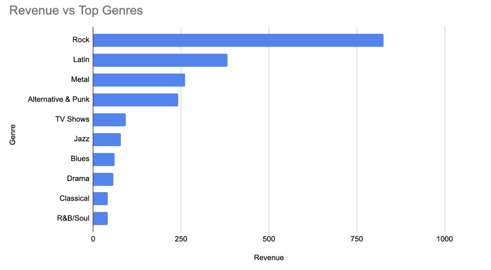
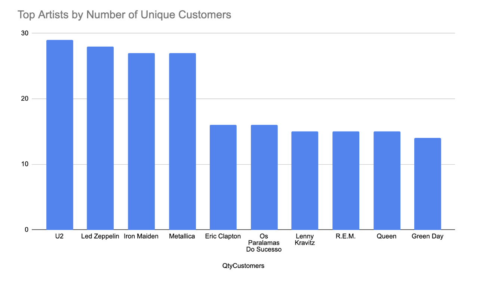
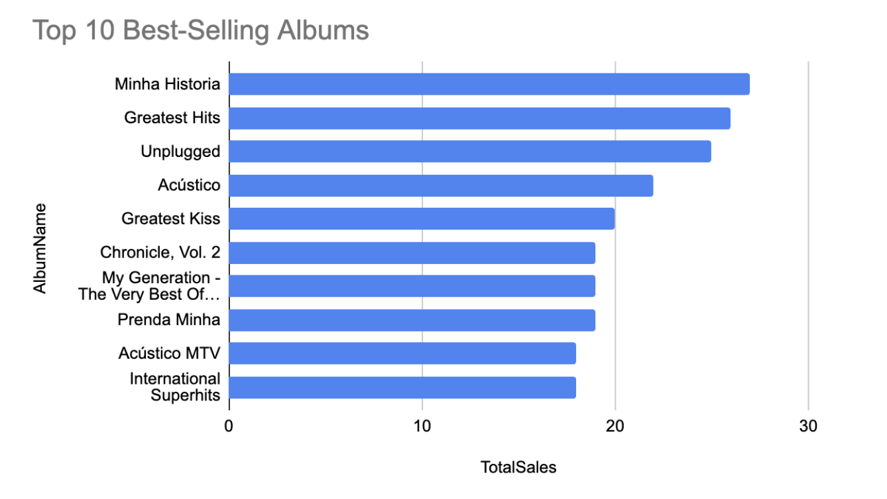
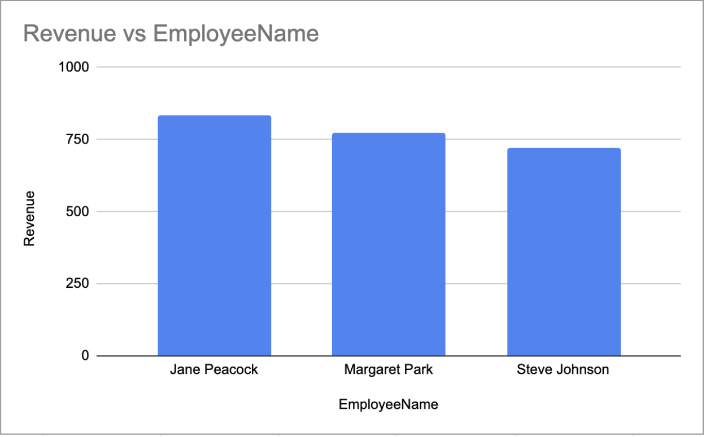

# SQL Chinook Database Analysis

## Overview

This project analyzes the Chinook music store database using SQL in Google BigQuery. The goal was to explore customer behavior, sales performance, music genres, artists, albums, and employee performance. The results were visualized in Microsoft Excel to highlight key business insights.

## Tools Used

* SQL
* Google BigQuery
* Microsoft Excel

## Skills Demonstrated

* Data Analysis
* Data Visualization
* JOINs
* Aggregate Functions
* GROUP BY
* Subqueries
* Common Table Expressions (CTEs)
* Window Functions

## Business Questions

* Which countries generate the most invoices?
* Who is the best customer?
* Which music genres generate the highest revenue?
* Which artists attract the most unique customers?
* Which albums sell the best?
* Which employees generate the most revenue through their customers?

## Key Insights

* Rock was the highest-revenue genre in the database.
* U2 had the largest number of unique customers.
* "Minha Historia" was the best-selling album.
* Jane Peacock generated the highest revenue through supported customers.
* Customer purchasing behavior varies significantly across countries.

## Visualizations

### Revenue by Genre

### Top Artists by Number of Unique Customers

### Best Selling Albums

### Revenue by Employee

